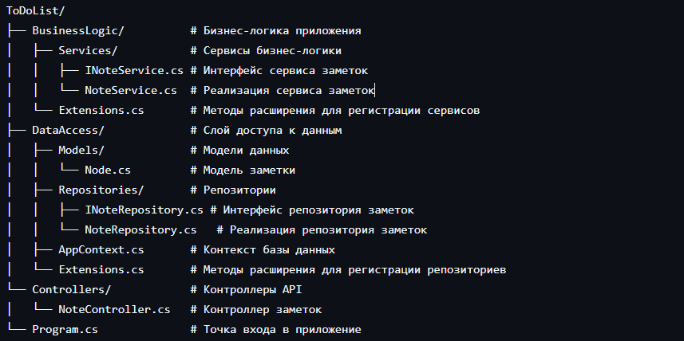
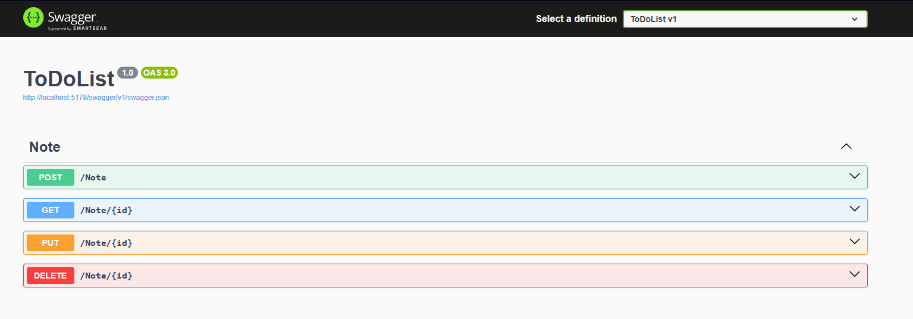
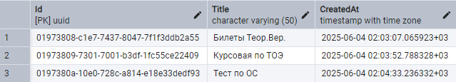

# TodoList

## Описание

Это приложение представляет собой простой сервис для управления заметками. Оно позволяет создавать, читать, обновлять и удалять заметки.

## Структура проекта

## Использование

После запуска приложения вы можете использовать следующие конечные точки API:

- `POST /Note`: Создать новую заметку.
- `GET /Note/{id}`: Получить заметку по идентификатору.
- `PUT /Note/{id}`: Обновить заметку по идентификатору.
- `DELETE /Note/{id}`: Удалить заметку по идентификатору.

Данные сохраняются в БД PostgreSQL

## Зависимости

- Microsoft.EntityFrameworkCore
- Microsoft.EntityFrameworkCore.Design
- Npgsql.EntityFrameworkCore.PostgreSQL

